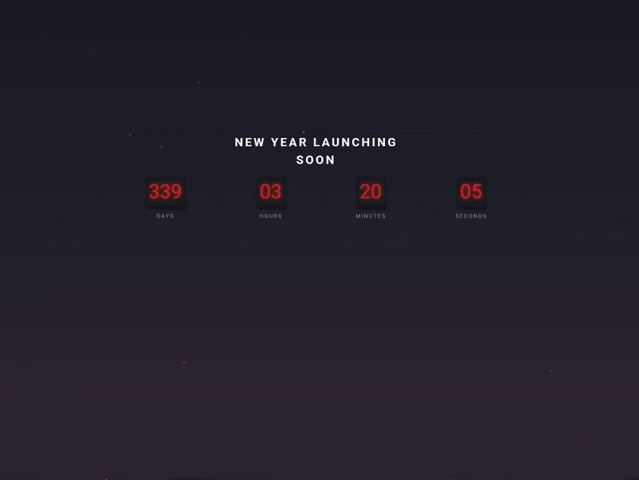

# Countdown Timer

A visually immersive countdown timer that tracks the precise time remaining until the next New Year. It combines accurate date mathematics with HTML Canvas particles and parallax animations to create a "sliding down a mountain" atmospheric effect.

## 🔗 Links

- **Live Demo Link:** https://e3prime.github.io/countdown_timer

## ⏳ Countdown Timer Showcase

## 🧐 About The Project

This project explores the intersection of **Logic** and **Art**. While the core function is a timer, the focus was on creating a mood.

It calculates the millisecond difference between the current moment and January 1st of the upcoming year, updating the DOM every second. Visually, it utilizes the Canvas API to render a flare/particle system and CSS animations to create a "Point of View" (POV) effect of sliding down a slope.

### Key Features

- **Smart Date Calculation:**
  - Automatically detects the current year and sets the target to the _next_ year (e.g., if it's 2026, it counts down to 2027). This ensures the app never becomes outdated.
- **HTML Canvas Particles:**
  - Uses a JavaScript loop to generate and animate random particles (flares) on a `<canvas>` element, giving depth to the scene.
- **Parallax "Sliding" Effect:**
  - The foreground terrain moves continuously upwards via CSS animations, creating the optical illusion that the viewer is sliding downwards through the environment.
- **Atmospheric Styling:**
  - A custom gradient background and neon typography set a futuristic/night-time tone.

## 🛠️ Technologies Used

- **HTML** for the timer structure and canvas container.
- **CSS** for the animations (`@keyframes` for the sliding effect) and flexbox layout.
- **JavaScript** for:
  - **Date Object:** Calculating Days, Hours, Minutes, and Seconds.
  - **Canvas API:** Drawing and animating the particle system.
  - **`setInterval`:** Updating the countdown display in real-time.
